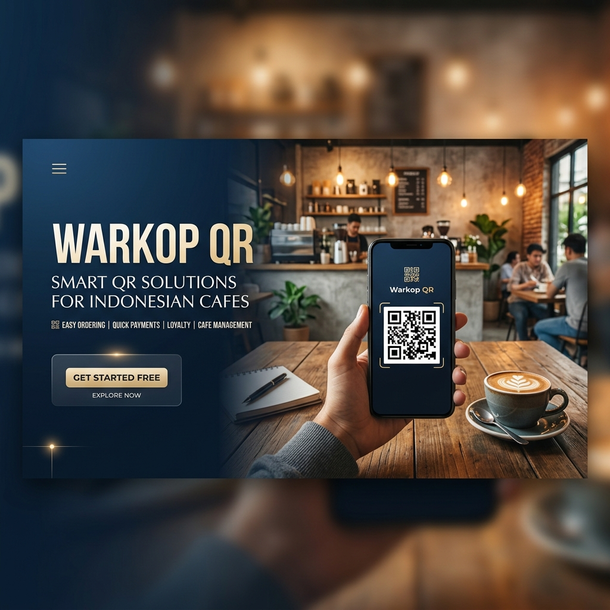
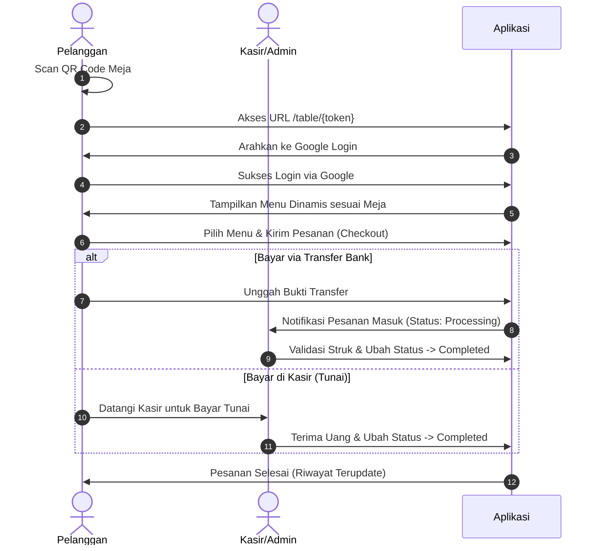

# Warkop QR - Sistem Pemesanan & POS Digital



**Warkop QR** adalah platform web modern berbasis **Laravel 12** yang dirancang untuk mendigitalisasi proses pemesanan makanan dan minuman di Warkop (Warung Kopi) atau Kafe melalui pemindaian kode QR di meja pelanggan. Sistem ini memadukan kemudahan pemesanan mandiri oleh pelanggan (Self-Order) dengan sistem Point of Sale (POS) kasir yang efisien dan aman.

---

## 🚀 Fitur Utama

Sistem ini memiliki dua kategori akses utama dengan pembagian peran (*role*) yang ketat:

### 1. Sisi Pelanggan (Customer)
* 📱 **Akses Cepat via QR Code**: Pelanggan cukup memindai QR Code di meja untuk langsung masuk ke halaman pemesanan dinamis yang disesuaikan dengan nomor meja mereka.
* 🔐 **Login Google (OAuth)**: Proses masuk yang instan dan aman menggunakan akun Google pribadi pelanggan.
* 🛒 **Keranjang Belanja Interaktif**: Pilih menu secara real-time, atur kuantitas, dan lihat total belanja tanpa perlu reload halaman.
* 💳 **Pilihan Metode Pembayaran**:
  * **Transfer Bank (BRI)**: Pelanggan dapat mengunggah bukti transfer/struk pembayaran langsung dari antarmuka web.
  * **Bayar di Kasir**: Pelanggan dapat memilih opsi pembayaran tunai langsung di kasir.
* 📜 **Riwayat Pemesanan (History)**: Memantau daftar pesanan yang pernah dibuat beserta status terkini (Pending, Processing, Completed, Cancelled).

### 2. Sisi Admin & Kasir
* 👤 **Multi-role (Super Admin & Kasir)**:
  * **Super Admin**: Memiliki hak akses penuh ke seluruh sistem administrasi.
  * **Kasir**: Dibatasi hanya untuk mencatat transaksi langsung (POS) dan memproses pesanan masuk.
* 🍔 **Manajemen Menu Produk (CRUD - Super Admin)**: Mengelola data makanan/minuman, mengunggah foto menu, deskripsi, harga, dan melakukan *toggle* status ketersediaan produk (Tersedia/Habis).
* 🪑 **Manajemen Meja Warkop (CRUD - Super Admin)**: Menambah meja baru dengan generator token QR otomatis (`bin2hex`), mencetak link scan meja, mengaktifkan/menonaktifkan meja, serta fitur salin link.
* 👥 **Manajemen Staf Kasir (CRUD - Super Admin)**: Registrasi akun kasir baru, memperbarui data, mengatur ulang sandi (*reset password*), dan menghapus akses kasir.
* 📥 **Pengelolaan Pesanan Masuk (Admin & Kasir)**: Memantau pesanan aktif dari pelanggan meja, memvalidasi bukti transfer pembayaran yang diunggah, serta memperbarui status transaksi.
* 🖥️ **Pesan Langsung / POS (Admin & Kasir)**: Fitur Point of Sale instan bagi pelanggan yang datang memesan langsung di meja kasir. Transaksi dicatat menggunakan meja virtual bernama "Pesan Langsung" dengan status otomatis `completed` dan mencatat ID staf kasir yang memprosesnya.

---

## 🔄 Diagram Alur Kerja (Workflow)



---

## 🛠️ Persyaratan Sistem

Sebelum menjalankan proyek ini secara lokal, pastikan perangkat Anda memiliki:
* **PHP** >= 8.2 (Disarankan PHP 8.3+)
* **Composer**
* **Node.js** & **NPM** (untuk build aset menggunakan Vite)
* **Laragon** / **XAMPP** (Web Server & MySQL)

---

## ⚙️ Panduan Instalasi & Konfigurasi

Ikuti langkah-langkah di bawah ini untuk menjalankan proyek ini di server lokal Laragon Anda:

1. **Letakkan Folder Proyek**  
   Pastikan folder proyek berada di direktori root server lokal Anda, contohnya:  
   `C:\laragon\www\warkop_QR`

2. **Instalasi Dependensi PHP**  
   Buka terminal di dalam folder proyek, kemudian jalankan:
   ```bash
   composer install
   ```

3. **Salin File Konfigurasi Lingkungan (`.env`)**  
   Salin file `.env.example` menjadi `.env`:
   ```bash
   copy .env.example .env
   ```

4. **Konfigurasi Database**  
   Buat database baru di MySQL dengan nama `db_warkop_qr`. Setelah itu, buka file `.env` dan sesuaikan konfigurasinya:
   ```env
   DB_CONNECTION=mysql
   DB_HOST=127.0.0.1
   DB_PORT=3306
   DB_DATABASE=db_warkop_qr
   DB_USERNAME=root
   DB_PASSWORD=
   ```

5. **Konfigurasi Google OAuth**  
   Dapatkan `Client ID` dan `Client Secret` dari Google Cloud Console. Masukkan datanya ke dalam file `.env`:
   ```env
   GOOGLE_CLIENT_ID="ISI_CLIENT_ID_ANDA"
   GOOGLE_CLIENT_SECRET="ISI_CLIENT_SECRET_ANDA"
   GOOGLE_REDIRECT_URI="http://127.0.0.1:8000/auth/google/callback"
   ```

6. **Generate Application Key**  
   Jalankan perintah berikut untuk menghasilkan key aplikasi baru:
   ```bash
   php artisan key:generate
   ```

7. **Migrasi Database & Seeding Data**  
   Jalankan migrasi untuk membuat tabel database dan mengisi data admin awal:
   ```bash
   php artisan migrate --seed
   ```

8. **Membuat Link Simbolik Storage**  
   Tautkan folder penyimpanan lokal ke folder public agar gambar produk dan bukti transfer dapat diakses:
   ```bash
   php artisan storage:link
   ```

9. **Build Aset Frontend (Vite)**  
   Instal dependensi NPM dan compile aset:
   ```bash
   npm install
   npm run build
   ```
   *(Atau jalankan `npm run dev` untuk mode pengembangan aktif).*

10. **Jalankan Aplikasi**  
    Jika menggunakan Laragon, aplikasi Anda dapat langsung diakses via domain virtual:  
    `http://warkop-qr.test`  
    Atau Anda dapat menggunakan server bawaan Laravel:
    ```bash
    php artisan serve
    ```

---

## 🔑 Cara Akses Aplikasi

### 1. Panel Administrasi (Super Admin / Kasir)
* **URL Login**: `http://localhost:8000/admin/login` atau `http://warkop-qr.test/admin/login`
* **Akun Super Admin Default**:
  * **Email**: `admin@warkop.com`
  * **Password**: `password`
* *Catatan*: Akun staf kasir baru dapat dibuat secara dinamis oleh Super Admin melalui menu **Kelola Staf** di panel admin.

### 2. Sisi Pelanggan (Meja Warkop)
* **URL Akses**: Pelanggan masuk dengan memindai kode QR unik meja. Format rute URL-nya adalah:  
  `http://warkop-qr.test/table/{token_meja}`  
  *(Tautan/token meja dapat dilihat dan disalin langsung dari panel **Kelola Meja** di dashboard Super Admin).*
* **Autentikasi**: Setelah membuka link, pelanggan masuk via Google Login untuk mulai memesan.

---

## 📂 Struktur Folder Penting

Berikut adalah beberapa berkas dan direktori penting dalam folder `warkop_QR`:
* `app/Http/Controllers/` : Berisi controller logika bisnis.
  * [GoogleAuthController.php](file:///c:/laragon/www/warkop_QR/app/Http/Controllers/GoogleAuthController.php) - Menangani autentikasi Google.
  * [OrderController.php](file:///c:/laragon/www/warkop_QR/app/Http/Controllers/OrderController.php) - Menangani order & riwayat pelanggan.
  * [PaymentController.php](file:///c:/laragon/www/warkop_QR/app/Http/Controllers/PaymentController.php) - Pengunggahan & validasi bukti transfer.
  * `admin/` - Manajemen backend admin (Produk, Meja, Staf Kasir, POS Pesan Langsung, dan Transaksi).
* `app/Http/Requests/` : Validasi data input ketat (*Form Request*).
* `resources/views/` : Kumpulan template Blade (Tampilan).
  * `customer/` - Tampilan menu, riwayat, dan pembayaran pelanggan.
  * `admin/` - Tampilan dasbor pengelolaan, POS, dan data master.
  * `layouts/` - Layout dasbor admin responsif.
* `routes/web.php` : Pendaftaran seluruh rute web aplikasi.
* `comment.txt` : Log transparansi dan riwayat perubahan kode pengembang.

